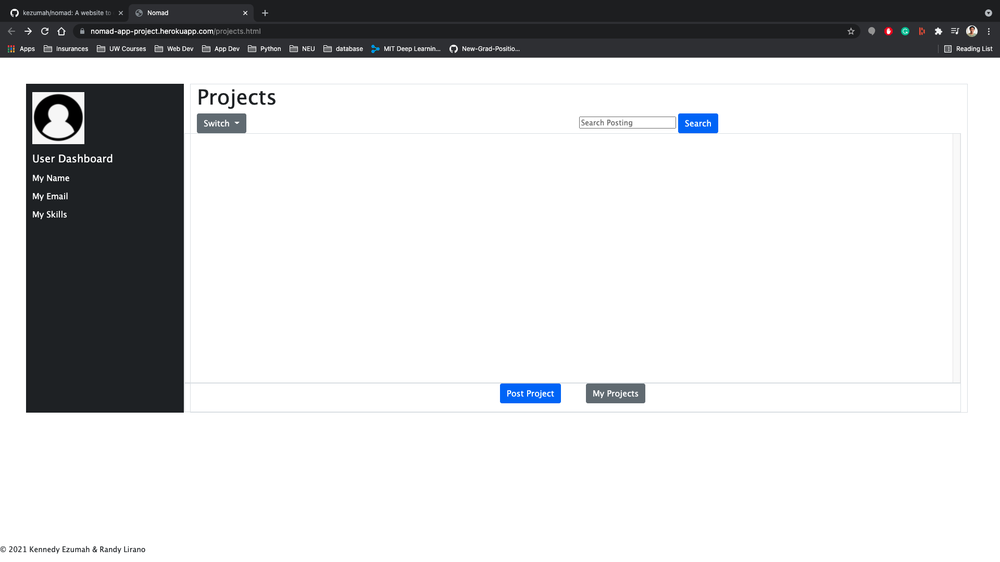
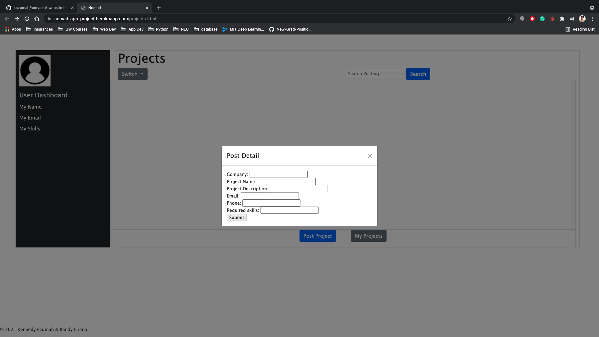
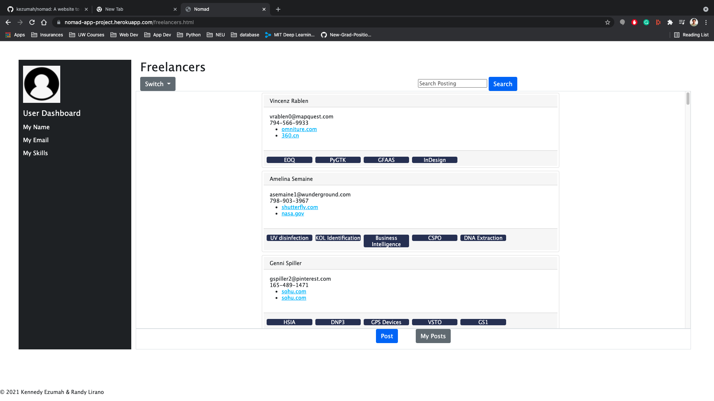
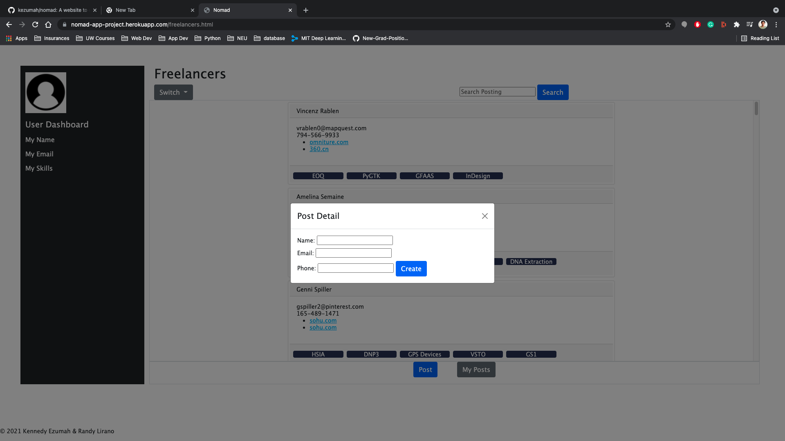
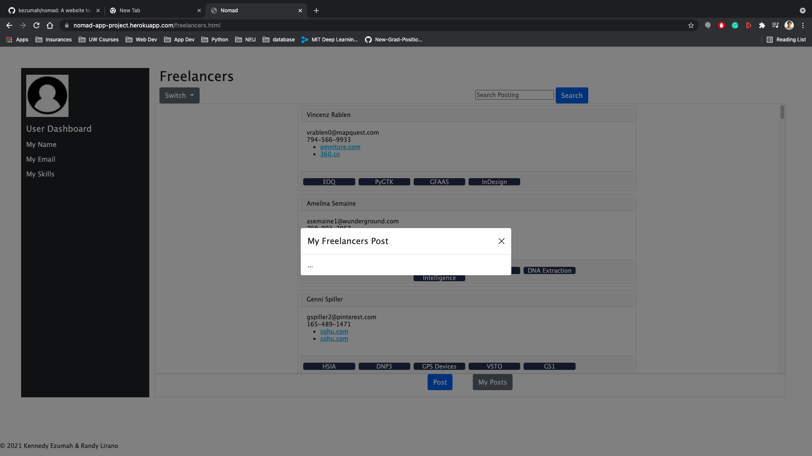

# nomad
A website to connect project owners with freelancers.

## Objective
This project is intended to focus on backend development using Node.js and Express. The database for the website was built using a non-relational database called Mongo DB. The database was hosted using MongoDB Atlas as our database server.

## Screenshots

## How-To-Use
There are 2 ways to use this project.
1. Visit our deployed application at Heroku. (link below)
2. Clone this git repository.

### Using our deployed version
Please visit our deployed application for the client version.

### Using locally via `git clone`
Once you clone our repository, make sure to install all dependencies.
Run the following command inside nomad root folder to install all dependencies: `npm install`

At the `db` folder, we have provided 2 JSON files to be used as a collection for the database.

### Relevant Links
[Demo](https://nomad-app-project.herokuapp.com/)
[Video](https://youtu.be/aumBmPMepUE)
[Slides](https://docs.google.com/presentation/d/1BTYYXypbosWAm4gJ2Wu3WdDcv5MKs_HqppMUeoTTZis/edit?usp=sharing)
[Class](https://johnguerra.co/classes/webDevelopment_fall_2021/)
